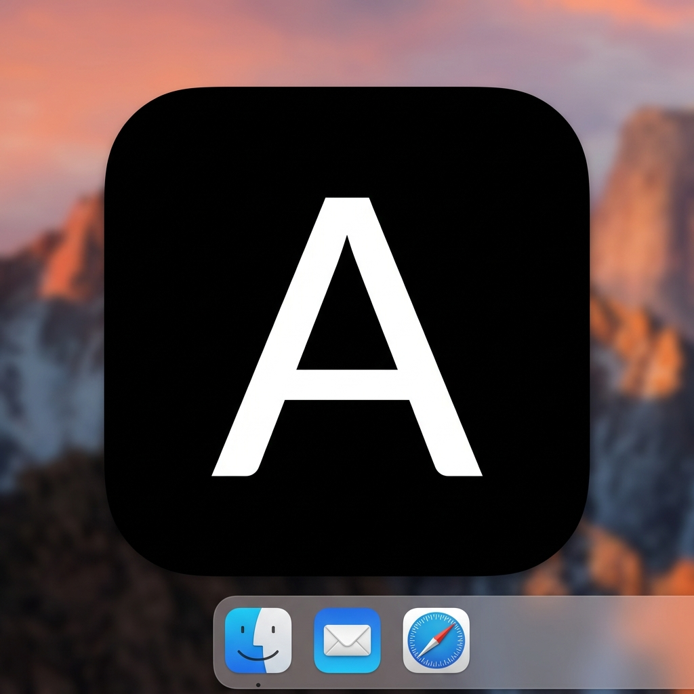

# 🌍 Antigravity AI Ecosystem

> **The ultimate universal hub and command center for AI-driven development. Zero bloat, zero context hallucinations, maximum performance across any operating system.**

## 🎯 What is this project and what is it for?

This repository serves as the **Global Master Database** for the Antigravity IDE and your AI coding agents. It transforms a standard AI coding assistant into a fully autonomous, context-aware development team—often referred to as a **Swarm**.

### The Problem It Solves
Historically, AI assistants suffer from **context fragmentation** and **hallucinations**. Developers usually have isolated, hidden `.gemini/` or `.cursor/` folders scattered across hundreds of repositories. When you update a prompt in one project, the others remain outdated. The AI forgets rules, repeats mistakes, and constantly requires manual hand-holding.

### The Solution: The Flat Global Architecture
Its primary purpose is to **provide a universal standard**. Instead of each project having its own isolated and outdated AI instructions, this ecosystem centralizes everything into a single, highly-curated repository located at `~/.gemini/antigravity/`. 
- **No Duplicates**: A skill is updated here, and it instantly applies to all your active projects.
- **No Blind Spots**: The IDE parses the exact same workflows regardless of what directory your terminal is in.
- **Compound Memory**: It actively learns from mistakes and records them into localized `Knowledge Items (KI)`, preventing repeated errors across the entire ecosystem.

---

## 👥 Who is it for & How does it help?

- **Solo Developers & Indie Hackers**: Helps you code 10x faster by providing pre-written, highly optimized workflows. Need to build a native Mac app? Just use the existing macOS skills. No need to teach the AI *how* to code—it already knows the best practices.
- **Development Teams**: Provides a unified standard. Every developer on your team will have the exact same AI guardrails, ensuring that code quality, security protocols, and testing standards remain perfectly consistent across all commits.
- **AI Orchestrators (Agents)**: This is fundamentally an API for AI. It gives AI agents the structured blueprints they need to execute massive tasks (like full codebase refactors or E2E UI testing) autonomously, without waiting for human input.

---

## ⚡ The AntigravityBar (Status Bar App)

A cornerstone of this ecosystem is the **AntigravityBar**, a lightweight native macOS application that acts as the bridge between this GitHub repository and your Local System.

### What it does:
- **Dashboard & System Metrics**: Acts as a professional dashboard, providing real-time monitoring of your machine's **CPU, GPU, and RAM** with visual, color-coded load indicators.
- **Process & Context Manager**: Dynamically detects your active IDE window and intelligently swaps out the AI `PROFILE.md` pre-sets to prevent context cross-contamination.
- **Ecosystem Syncing**: Automatically fetches and updates the latest workflows, agent personas, and skills directly from this GitHub repository.
- **Zero-Prompt Setup Wizards**: Offers a sleek, native visual wizard to configure your entire development environment—no terminal commands required.
- **Model Quota Tracking**: Keeps track of your active model limits (Gemini 3.1 Pro, Claude 3.5 Sonnet, O1, etc.) directly in the menu bar.

---

## 📂 Ecosystem Structure (What Does What?)

The ecosystem is strictly divided by responsibility. Here is how the AI navigates this repository:

### 1. `/global_workflows` (Macro Operations)
These are high-level orchestrations triggered via `/slash-commands`. They tell the AI *what* process to run.
- **Planning & Design**: Workflows like `/grill-me` (relentless architecture stress-testing), `/request-refactor-plan` (planning safe incremental refactoring), and `/ubiquitous-language` (extracting DDD terminology).
- **Communication**: `/caveman` (ultra-compressed communication to save tokens and skip the fluff).
- **CI/CD & DevOps**: Scripts for setting up GitHub Actions, automating PR generation (`/pr-writer`), and local deployments (`/build-local`).

### 2. `/skills` (Micro Instructions)
These are stack-specific rules that teach the AI *how* to write code for your specific language.
- Contains highly specific technical instructions covering modern tech stacks (`React`, `Swift`, `Python`, `Rust`).
- Enforces best practices (e.g., "Never use Tailwind unless requested", "Always use `Result` types in Rust").

### 3. `/agents` (AI Personas)
Distinct AI identities that can be swapped dynamically to handle specialized tasks:
- **Architect**: Focuses purely on system design and database models.
- **Developer**: Focuses on clean, bug-free execution.
- **QA Tester**: Operates the `/qa-orchestrator` to find edge cases and write automated tests.

### 4. `/templates` (System Files)
Standardized blueprints used to format project execution:
- `GEMINI.md`: The universal project constitution featuring Compound Memory.
- `SWARM_STATE.md`: Used for "Agent Handovers" and parallel execution via Git Worktrees.
- `SECRETS_MAP.md`: A mapping of local environment variables to prevent accidental hardcoding.

### 5. `/status-bar` (Source Code)
The Swift source code for the AntigravityBar application.

---

## 🚀 First-Time Onboarding

Ready to supercharge your IDE? There are two ways to set up your perfectly tailored environment:

### Flow A: AI-Driven Onboarding (Recommended)
1. Open your **Antigravity IDE**.
2. Drop this repository link into the AI chat: `https://github.com/helgklaizar/AI-Ecosystem`
3. The Agent will autonomously find the `AI_ONBOARDING.md` file, read the instructions, install the Status Bar, and interactively compile your local settings based on your stack.

### Flow B: Visual Setup
1. Compile and launch the **Antigravity Bar** from the `status-bar/` folder.
2. Follow the sleek setup wizard.
3. Select your tech stack. The Status Bar will pull **ONLY** the necessary assets from this Global Database into your `~/.gemini/antigravity/` folder to keep your IDE blazing fast.

---

## 🧠 Documentation & Standards

- 📖 **[The Ecosystem Guide](ECOSYSTEM_GUIDE.md)** — The curated list of essential stacks and architectural rules.
- 🚀 **[The Onboarding Script](AI_ONBOARDING.md)** — Core AI instructions for generating dynamic configurations.

---
## 📄 License
MIT
